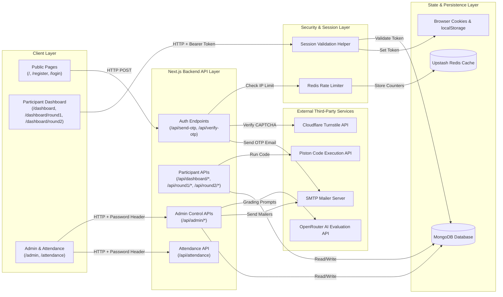

# System Architecture — Espionage Rebuild

This document describes the architectural components, communication paths, state locations, and key engineering decisions for the rebuilt Espionage platform.

---

## 1. System Architecture Diagram

---

## 2. Component Communication & Responsibilities

1. **Client Layer (Next.js App Router)**:
   - Client components render interactive views: Monaco Editor, timer displays, and MCQ selection.
   - All server requests attach either an `Authorization: Bearer <token>` header or `x-admin-password` header.

2. **Security & Session Layer**:
   - `validateParticipantSession(req)`: Server utility extracting tokens from request headers/cookies and validating active session records against MongoDB.
   - Redis Rate Limiter: Distributed rate limiting tracking client requests per window using Upstash/Vercel KV.

3. **Backend API Layer**:
   - Handles route execution, server-side timer calculations, anti-cheat violation increments, and question shuffling.

4. **External Services**:
   - **SMTP Mailer**: Transmits OTP codes, RSVP confirmations, and QR attendance passes.
   - **Cloudflare Turnstile**: Verifies bot prevention tokens on registration and login.
   - **Piston Execution Engine**: Executes untrusted candidate source code in isolated sandboxes.
   - **OpenRouter API**: Evaluates code submissions using LLMs with prompt isolation wrapper.

---

## 3. Where State Lives

| State Type | Storage Location | Details & Lifecycle |
|---|---|---|
| **Persistent Application Data** | MongoDB Database | Participant profiles, `sessionToken`, test start timestamps (`round1StartedAt`), submitted code, scores, and global event flags. |
| **Distributed Rate Limits** | Redis / KV Storage | Key-value expirations tracking IP request counts across serverless lambdas. |
| **Client Session Tokens** | Browser Cookies / localStorage | Cryptographic session tokens stored client-side and attached to API calls. |
| **Static Assets** | Public Directory / CDN | Brand images, static assets, and client bundle files. |

---

## 4. Key Decisions & Rationale

1. **Database-Backed Session Tokens over Unsaved Hashes**:
   - *Decision*: Save `sessionToken` directly on the `Participant` model upon OTP verification.
   - *Rationale*: Eliminates BOLA vulnerabilities by enabling strict server-side authorization checks on all dashboard, test execution, and submission endpoints.

2. **Server-Side Timestamp Validation over Client Timers**:
   - *Decision*: Record `round1StartedAt` and `round2StartedAt` in MongoDB when a test is initiated.
   - *Rationale*: Prevents students from bypassing time limits by reloading the browser or tampering with client JavaScript state.

3. **Sequential Counter ID Generation (`ESP-0001`)**:
   - *Decision*: Use atomic `$inc` or `countDocuments()` calculation rather than 3-digit random loops.
   - *Rationale*: Eliminates pool exhaustion, infinite loops, and CPU lockups near capacity limits.

4. **Prompt Isolation with XML Delimiters**:
   - *Decision*: Wrap code inside `<user_submission>` tags and separate system/user prompt roles.
   - *Rationale*: Protects LLM scoring mechanisms against direct prompt injection embedded within candidate source comments.
